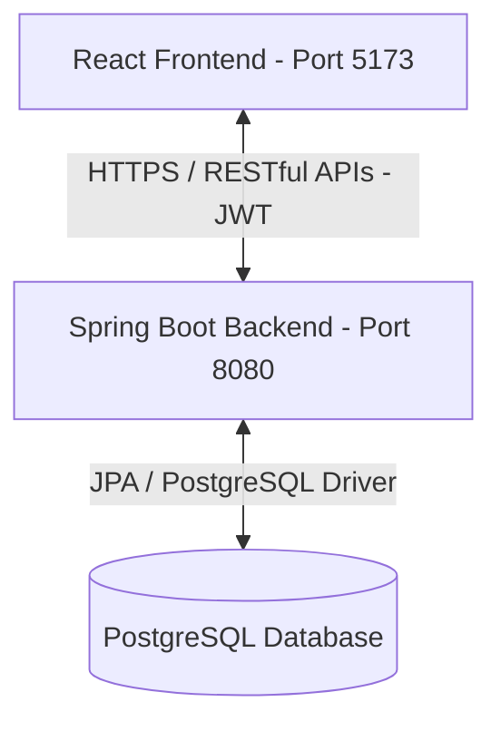

# 🎬 TỔNG QUAN DỰ ÁN (PROJECT OVERVIEW) - THDPV Movie Theater

Chào mừng bạn đến với tài liệu tổng quan dự án **THDPV Movie Theater** — một nền tảng website đặt vé xem phim trực tuyến hiện đại, tối ưu trải nghiệm người dùng với thiết kế đậm chất điện ảnh, hệ thống xác thực bảo mật và kiến trúc hệ thống Client-Server phân rã rõ ràng.

---

## 📌 1. Mục tiêu Dự án

Dự án hướng tới xây dựng một hệ thống đặt vé xem phim hoàn chỉnh bao gồm:

1. **Frontend (Client):** Cung cấp giao diện xem lịch chiếu, chọn ghế, đặt vé và quản lý tài khoản người dùng với hiệu ứng hoạt họa mượt mà, hỗ trợ Responsive trên mọi kích thước màn hình.
2. **Backend (Server):** Xử lý nghiệp vụ xác thực (Authentication/Authorization) dựa trên JWT, quản lý người dùng, phân quyền vai trò (Admin, Staff, Customer), và trong tương lai sẽ quản lý phim, phòng chiếu, suất chiếu và giao dịch thanh toán.

---

## 🛠️ 2. Công nghệ Sử dụng (Technology Stack)

### **Frontend (Client)**

- **Core Framework:** [React 19](https://react.dev/) & [TypeScript](https://www.typescriptlang.org/)
- **Build Tool:** [Vite](https://vitejs.dev/) (Tối ưu hóa thời gian build và Hot Reload nhanh chóng)
- **Styling:** [TailwindCSS 3](https://tailwindcss.com/) + PostCSS (Thiết kế nhanh chóng, nhất quán hệ màu sắc)
- **Animations:** [Framer Motion](https://www.framer.com/motion/) (Tạo các hiệu ứng transition và micro-interaction mượt mà)
- **Forms & Validation:** [React Hook Form](https://react-hook-form.com/) & [Zod](https://zod.dev/) (Xác thực dữ liệu đầu vào mạnh mẽ phía client)
- **Routing:** [React Router DOM 6](https://reactrouter.com/) (Hỗ trợ cấu trúc định tuyến phân cấp và bảo vệ route)
- **HTTP Client:** [Axios](https://axios-http.com/) (Hỗ trợ Interceptors xử lý JWT tự động gửi kèm Request)
- **State Management:** React Context (Quản lý trạng thái đăng nhập toàn cục)

### **Backend (Server)**

- **Language & Framework:** [Java 21](https://openjdk.org/) & [Spring Boot 3.5.14](https://spring.io/projects/spring-boot)
- **Security:** [Spring Security 6](https://spring.io/projects/spring-security) (Cấu hình bảo mật, phân quyền Endpoint)
- **Database Access:** [Spring Data JPA](https://spring.io/projects/spring-data-jpa) & Hibernate ORM
- **Database:** [PostgreSQL](https://www.postgresql.org/) (Hệ quản trị cơ sở dữ liệu quan hệ mạnh mẽ, đáng tin cậy)
- **Authentication Token:** [JJWT (Java JWT) 0.12.6](https://github.com/jwtk/jjwt)
- **Utility & DevTools:** Lombok, Spring Boot DevTools
- **Dependency Manager:** Maven

---

## 📐 3. Kiến trúc Hệ thống (System Architecture)

Dự án áp dụng mô hình kiến trúc **Client-Server độc lập**:



- **Client side:** Chạy độc lập, giao tiếp với Server thông qua REST API. JWT token sau khi đăng nhập thành công sẽ được lưu trữ phía client và tự động đính kèm vào Header `Authorization: Bearer <token>` thông qua Axios Request Interceptor.
- **Server side:** Xử lý xác thực yêu cầu dựa trên `JwtAuthTokenFilter`. Nếu token hợp lệ, lưu thông tin xác thực vào Security Context. Dữ liệu được quản lý và truy vấn từ cơ sở dữ liệu PostgreSQL.

---

## 📁 4. Cấu trúc Thư mục Toàn diện

### **Frontend Folder Structure**

```
thdpv-movie-theater-fe/
├── public/                  # Các file tĩnh (logo, banner, ảnh nền)
├── src/
│   ├── app/                 # Thành phần cốt lõi của ứng dụng (ErrorBoundary, Styles)
│   ├── features/            # Các tính năng nghiệp vụ của ứng dụng
│   │   └── auth/            # Tính năng xác thực
│   │       ├── api/         # Gọi API tới backend (authService.ts)
│   │       ├── components/  # Các component hỗ trợ (AuthLayout, AuthCard, AuthInput,...)
│   │       ├── hooks/       # Custom hooks (useAuth, useLocalStorage)
│   │       ├── pages/       # Các trang xác thực (Login, Register, Forgot, Reset)
│   │       ├── routes/      # Định tuyến các trang Auth
│   │       ├── store/       # React Context lưu trữ thông tin AuthState
│   │       └── utils/       # Định nghĩa Schema Zod xác thực form
│   ├── shared/              # Các thành phần dùng chung cho toàn bộ website
│   │   ├── components/      # UI Elements dùng chung (Buttons, Modals,...)
│   │   ├── constants/       # Hằng số toàn cục
│   │   ├── services/        # Service thông báo (NotificationService)
│   │   └── utils/           # Helper functions và logger.ts
│   ├── App.tsx              # Component tổng của ứng dụng, cấu hình Route chính
│   ├── main.tsx             # Entrypoint chính của React
│   ├── index.css            # CSS toàn cục tích hợp TailwindCSS
│   └── index.ts
└── [Các file cấu hình: tailwind.config.js, vite.config.ts, tsconfig.json...]
```

### **Backend Folder Structure**

```
movie-theater-be/
├── src/main/
│   ├── java/com/thdpv/movietheater/
│   │   ├── auth/            # Module xử lý Đăng nhập & Đăng ký
│   │   │   ├── controller/  # AuthController (Định nghĩa endpoints /api/*)
│   │   │   ├── dto/         # Đối tượng chuyển đổi dữ liệu (LoginRequest, JwtResponse)
│   │   │   ├── repository/  # UserRoleRepository
│   │   │   └── service/     # AuthService (Xử lý nghiệp vụ authenticate người dùng)
│   │   ├── config/          # Cấu hình hạt giống dữ liệu (DataSeeder) và RoleRepository
│   │   ├── security/        # Cấu hình bảo mật hệ thống
│   │   │   ├── CustomUserDetailsService.java # Tải dữ liệu người dùng từ database
│   │   │   ├── JwtAuthTokenFilter.java       # Bộ lọc kiểm tra JWT đính kèm request
│   │   │   ├── JwtUtils.java                 # Tiện ích tạo và giải mã JWT
│   │   │   └── SecurityConfig.java           # Định cấu hình Spring Security (CORS, Phân quyền)
│   │   └── user/            # Module quản lý thông tin User & Role
│   │       ├── entity/      # Các thực thể JPA (User, Role, UserRole)
│   │       ├── enums/       # Các định nghĩa Enum (RoleName, UserStatus)
│   │       └── repository/  # UserRepository
│   └── resources/
│       ├── application.properties # Cấu hình Database, JWT, Seed Data
│       └── [Các file cấu hình tĩnh khác...]
└── pom.xml                  # Quản lý thư viện Maven
```

---

## 🎨 5. Quy chuẩn Thiết kế (Design System)

Giao diện ứng dụng được phát triển theo hướng **Cinematic Dark Mode** nhằm mang lại cảm giác nhập vai như đang ở trong rạp phim thực tế:

- **Màu nền chính (Primary Dark):** `#0f0f0f` — Màu tối sâu giúp làm nổi bật thông tin.
- **Màu phụ (Secondary Dark):** `#1a1a1a` — Cho các thẻ Card, Input.
- **Màu nhấn (Accent Red):** `#dc2626` — Tượng trưng cho rèm đỏ rạp chiếu phim và màu thương hiệu.
- **Hiệu ứng Glassmorphism:** Kết hợp độ mờ backdrop blur `backdrop-blur-md` cùng viền mờ `rgba(255, 255, 255, 0.1)` tạo hiệu ứng kính hiện đại.
- **Phông chữ:** `Inter` (Sans-serif) giúp thông tin hiển thị rõ ràng, chuyên nghiệp.

--- ( Bổ sung ở bên dưới)

## 🛠️ 6. Ngăn xếp Công nghệ Nâng cao & Hạ tầng Hệ thống (Advanced Tech Stack & Infrastructure)

Để đáp ứng mô hình kiến trúc phân tán dịch vụ (Microservices), hệ thống bổ sung các giải pháp hạ tầng liên dịch vụ nhằm đảm bảo tính toàn vẹn dữ liệu và tối ưu hóa hiệu năng phản hồi:

### A. Giao tiếp Liên Dịch vụ Đồng bộ (Synchronous Communication)

- **Công nghệ tích hợp:** `Spring Cloud OpenFeign`
- **Vị trí kiến trúc:** Declarative REST Client (Trình gọi dịch vụ dạng khai báo).
- **Nhiệm vụ trong dự án:** Giải quyết bài toán truy xuất chéo dữ liệu thời gian thực giữa các database độc lập (Database per Service).
  - _Ứng dụng thực tế:_ Khi người dùng thực hiện luồng đặt vé tại `Booking Service`, hệ thống sẽ kích hoạt OpenFeign để thực hiện lệnh gọi đồng bộ (HTTP Request/Response) sang `User Service` nhằm kiểm tra hạng thành viên, đồng thời gọi sang `Movie Service` xác thực thông tin suất chiếu và phòng chiếu hợp lệ trước khi tính tổng tiền hóa đơn.

### B. Hạ tầng Trung chuyển Tin nhắn Bất đồng bộ (Asynchronous Message Broker)

- **Công nghệ tích hợp:** `RabbitMQ` (Mô hình Hàng đợi tin nhắn - Message Queue)
- **Vị trí kiến trúc:** Middleware (Phần mềm trung gian điều phối sự kiện).
- **Nhiệm vụ trong dự án:** Giải quyết bài toán quá tải luồng chính (Main Thread) và tách biệt hóa các tác vụ tiêu tốn thời gian xử lý (Decoupling Services).
  - _Ứng dụng thực tế:_ Thao tác gửi Email vé xem phim kèm mã QR qua SMTP Server thường mất từ 2-4 giây để phản hồi. Thay vì bắt khách hàng đợi trên giao diện, `Payment Service` sau khi nhận Callback thành công chỉ cần đẩy một Sự kiện (Event) `OrderPaidSuccess` vào RabbitMQ và lập tức trả về kết quả thành công cho Client (Thời gian phản hồi < 100ms). `Notification Service` đứng độc lập ở dưới sẽ tự động nhặt tin nhắn trong hàng đợi (Queue) của RabbitMQ để xử lý gửi mail ngầm.

---

## 🔒 7. Quản lý Giao dịch Phân tán (Distributed Transactions Architecture)

Do hệ thống triển khai kiến trúc **Database per Service**, mọi thao tác ghi dữ liệu liên dịch vụ (Cross-cutting Concerns) không thể sử dụng cơ chế quản lý giao dịch cục bộ `@Transactional` thông thường của Spring Framework.

### Kiến trúc giải pháp: Saga Pattern (Orchestration-based)

Hệ thống sử dụng một bộ điều phối trung tâm (`Saga Coordinator`) nằm tại dịch vụ lõi để quản lý chuỗi trạng thái giao dịch:

1. **Giao dịch xuôi (Forward Transactions):** Đặt vé tạm thời -> Khóa sơ đồ ghế -> Xác nhận thanh toán qua cổng VNPay/Momo -> Tích điểm thành viên.
2. **Giao dịch bù (Compensating Transactions):** Nếu một mắt xích bất kỳ trong chuỗi bị thất bại (Ví dụ: Cổng thanh toán báo lỗi hủy giao dịch từ phía người dùng), `Saga Coordinator` sẽ ngay lập tức phát tín hiệu kích hoạt chuỗi giao dịch bù ngược để hủy đơn hàng, chuyển đổi trạng thái dữ liệu trong database về nguyên bản, giải phóng ghế và đối soát tài khoản, đảm bảo tính nhất quán dữ liệu cuối cùng (**Eventual Consistency**) cho hệ thống.
