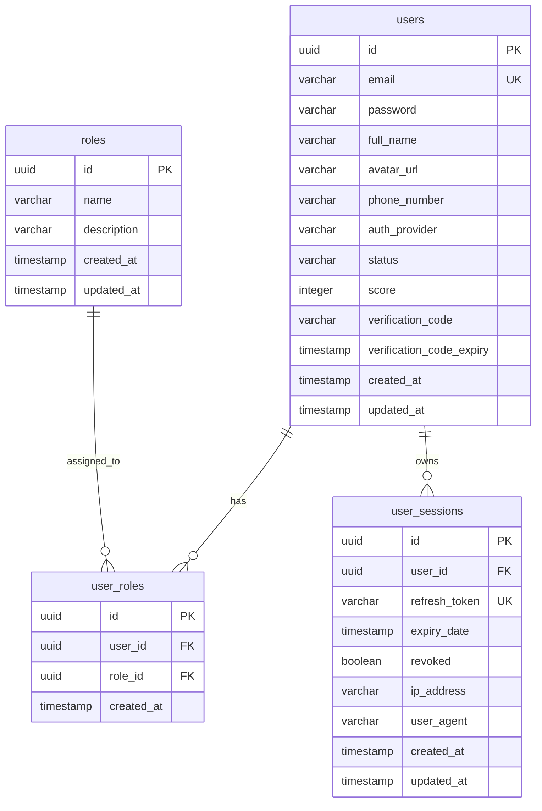
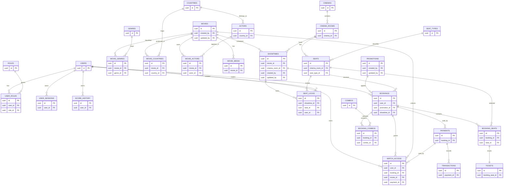

# THIET KE CO SO DU LIEU (DATABASE DESIGN) - NASAFILM

Tai lieu nay mo ta thiet ke co so du lieu cho he thong NasaFilm su dung PostgreSQL.
No duoc chia thanh 2 phan ro rang:

- `Current schema`: cac bang da ton tai va dang duoc backend Spring Boot mapping.
- `Target schema`: mo hinh du kien cho he thong dat ve rap phim day du.

Muc tieu cua tai lieu:

- giup team nhin nhanh duoc pham vi da lam va chua lam,
- tranh nham lan giua schema dang chay va schema de xuat,
- lam co so cho viec thiet ke API, entity va migration sau nay.

---

## 1. Tong quan thiet ke

### 1.1. He quan tri co so du lieu

- Database: `PostgreSQL`
- ORM hien tai: `Spring Data JPA` + `Hibernate`
- Kieu khoa chinh uu tien: `UUID`
- Quy uoc timestamp: `created_at`, `updated_at`

### 1.2. Nguyen tac mo hinh du lieu

- Tach bang trung gian cho quan he nhieu-nhieu.
- Uu tien luu `snapshot data` cho giao dich quan trong nhu gia ve, gia combo.
- Cac bang nghiep vu giao dich can co cot `status`.
- Co the truy vet nguoi tao/cap nhat voi `created_by`, `updated_by` khi can.

---

## 2. Current Schema

Backend hien tai moi implement nhom xac thuc, nguoi dung va session.
4 bang da duoc mapping trong code:

- `users`
- `roles`
- `user_roles`
- `user_sessions`

### 2.1. ERD hien tai

### 2.2. Data dictionary hien tai

#### `users`

Luu thong tin tai khoan va thong tin co ban cua nguoi dung.

| Column | Type | Rang buoc | Mo ta |
|---|---|---|---|
| `id` | UUID | PK | Dinh danh nguoi dung |
| `email` | VARCHAR | unique, not null | Email dang nhap |
| `password` | VARCHAR | nullable | Mat khau da bam; co the null voi tai khoan Google |
| `full_name` | VARCHAR | not null | Ho ten hien thi |
| `avatar_url` | VARCHAR | nullable | Anh dai dien |
| `phone_number` | VARCHAR | nullable | So dien thoai |
| `auth_provider` | VARCHAR | nullable | `LOCAL`, `GOOGLE` |
| `status` | VARCHAR | nullable | `ACTIVE`, `INACTIVE`, `SUSPENDED`, `BANNED`, `DELETED`, `PENDING_VERIFICATION` |
| `score` | INTEGER | default `0` | Diem tich luy |
| `verification_code` | VARCHAR | nullable | Ma xac minh tai khoan |
| `verification_code_expiry` | TIMESTAMP | nullable | Han het cua ma xac minh |
| `created_at` | TIMESTAMP | auto | Thoi gian tao |
| `updated_at` | TIMESTAMP | auto | Thoi gian cap nhat |

#### `roles`

Danh muc vai tro he thong.

| Column | Type | Rang buoc | Mo ta |
|---|---|---|---|
| `id` | UUID | PK | Dinh danh vai tro |
| `name` | VARCHAR | enum | `ADMIN`, `STAFF`, `CUSTOMER` |
| `description` | VARCHAR | nullable | Mo ta vai tro |
| `created_at` | TIMESTAMP | auto | Thoi gian tao |
| `updated_at` | TIMESTAMP | auto | Thoi gian cap nhat |

#### `user_roles`

Bang trung gian mapping nguoi dung voi vai tro.

| Column | Type | Rang buoc | Mo ta |
|---|---|---|---|
| `id` | UUID | PK | Dinh danh ban ghi |
| `user_id` | UUID | FK -> `users.id` | Nguoi dung |
| `role_id` | UUID | FK -> `roles.id` | Vai tro |
| `created_at` | TIMESTAMP | auto | Thoi gian gan role |

#### `user_sessions`

Luu refresh token va phien dang nhap.

| Column | Type | Rang buoc | Mo ta |
|---|---|---|---|
| `id` | UUID | PK | Dinh danh phien |
| `user_id` | UUID | FK -> `users.id`, not null | Chu so huu phien |
| `refresh_token` | VARCHAR(128) | unique, not null | Refresh token |
| `expiry_date` | TIMESTAMP | not null | Thoi diem het han |
| `revoked` | BOOLEAN | not null | Danh dau token da bi thu hoi |
| `ip_address` | VARCHAR | nullable | IP dang nhap |
| `user_agent` | VARCHAR | nullable | Thong tin thiet bi/trinh duyet |
| `created_at` | TIMESTAMP | auto | Thoi gian tao |
| `updated_at` | TIMESTAMP | auto | Thoi gian cap nhat |

### 2.3. Nhan xet hien trang

- Schema hien tai du cho `register`, `login`, `refresh token`, `role assignment`.
- Chua co cac bang nghiep vu cho phim, rap, suat chieu, dat ve, thanh toan.
- `Current schema` can duoc giu on dinh, con `Target schema` ben duoi la de mo rong.

---

## 3. Target Schema

Schema muc tieu mo ta he thong dat ve rap phim day du, gom 6 nhom nghiep vu:

- User & Access
- Movie Catalog
- Cinema & Seat
- Showtime
- Booking & Payment
- Promotion & Loyalty

### 3.1. ERD muc tieu

---

## 4. Data dictionary theo module

Chi liet ke cac bang muc tieu o muc nghiep vu. Nhom `users`, `roles`, `user_roles`, `user_sessions` da duoc mo ta o phan current schema.

### 4.1. User & Loyalty

#### `score_history`

Luu lich su cong tru diem tich luy cua thanh vien.

| Column | Type | Mo ta |
|---|---|---|
| `id` | UUID | PK |
| `user_id` | UUID | FK -> `users.id` |
| `score_amount` | INTEGER | So diem thay doi |
| `type` | VARCHAR | `BOOKING`, `REWARD`, `REDEEM`, ... |
| `description` | VARCHAR | Ly do thay doi diem |
| `created_at` | TIMESTAMP | Thoi gian ghi nhan |

### 4.2. Movie Catalog

#### `movies`

Thong tin phim trung tam cua he thong.

| Column | Type | Mo ta |
|---|---|---|
| `id` | UUID | PK |
| `title` | VARCHAR | Ten phim |
| `description` | TEXT | Mo ta noi dung |
| `duration_minutes` | INTEGER | Thoi luong |
| `release_date` | DATE | Ngay khoi chieu |
| `status` | VARCHAR | `COMING_SOON`, `NOW_SHOWING`, `ENDED` |
| `created_at` | TIMESTAMP | Thoi gian tao |
| `updated_at` | TIMESTAMP | Thoi gian cap nhat |
| `created_by` | UUID | FK -> `users.id` |
| `updated_by` | UUID | FK -> `users.id` |

#### `genres`

| Column | Type | Mo ta |
|---|---|---|
| `id` | UUID | PK |
| `name` | VARCHAR | Ten the loai |

#### `movie_genres`

| Column | Type | Mo ta |
|---|---|---|
| `id` | UUID | PK |
| `movie_id` | UUID | FK -> `movies.id` |
| `genre_id` | UUID | FK -> `genres.id` |

#### `countries`

| Column | Type | Mo ta |
|---|---|---|
| `id` | UUID | PK |
| `code` | VARCHAR | Ma quoc gia |
| `name` | VARCHAR | Ten quoc gia |
| `created_at` | TIMESTAMP | Thoi gian tao |
| `updated_at` | TIMESTAMP | Thoi gian cap nhat |

#### `movie_countries`

| Column | Type | Mo ta |
|---|---|---|
| `id` | UUID | PK |
| `movie_id` | UUID | FK -> `movies.id` |
| `country_id` | UUID | FK -> `countries.id` |

#### `actors`

| Column | Type | Mo ta |
|---|---|---|
| `id` | UUID | PK |
| `full_name` | VARCHAR | Ten dien vien |
| `avatar_url` | VARCHAR | Anh chan dung |
| `country_id` | UUID | FK -> `countries.id` |

#### `movie_actors`

| Column | Type | Mo ta |
|---|---|---|
| `id` | UUID | PK |
| `movie_id` | UUID | FK -> `movies.id` |
| `actor_id` | UUID | FK -> `actors.id` |
| `character_name` | VARCHAR | Ten nhan vat |
| `cast_order` | INTEGER | Thu tu xuat hien |
| `is_main` | BOOLEAN | Danh dau vai chinh |

#### `movie_media`

| Column | Type | Mo ta |
|---|---|---|
| `id` | UUID | PK |
| `movie_id` | UUID | FK -> `movies.id` |
| `media_url` | VARCHAR | Link anh/video |
| `media_type` | VARCHAR | `POSTER`, `TRAILER`, `STILL` |
| `is_primary` | BOOLEAN | Anh/video dai dien |
| `created_at` | TIMESTAMP | Thoi gian tao |
| `sort_order` | INTEGER | Thu tu hien thi |
| `title` | VARCHAR | Tieu de media |

### 4.3. Cinema & Seat

#### `cinemas`

| Column | Type | Mo ta |
|---|---|---|
| `id` | UUID | PK |
| `name` | VARCHAR | Ten chi nhanh rap |
| `address` | VARCHAR | Dia chi |
| `phone_number` | VARCHAR | So lien he |

#### `cinema_rooms`

| Column | Type | Mo ta |
|---|---|---|
| `id` | UUID | PK |
| `cinema_id` | UUID | FK -> `cinemas.id` |
| `name` | VARCHAR | Ten phong chieu |
| `capacity` | INTEGER | Suc chua |
| `status` | VARCHAR | `ACTIVE`, `MAINTENANCE` |

#### `seat_types`

| Column | Type | Mo ta |
|---|---|---|
| `id` | UUID | PK |
| `name` | VARCHAR | `STANDARD`, `VIP`, `COUPLE` |
| `description` | VARCHAR | Mo ta loai ghe |
| `price_modifier` | DECIMAL | Phu thu them vao gia co ban |

#### `seats`

| Column | Type | Mo ta |
|---|---|---|
| `id` | UUID | PK |
| `cinema_room_id` | UUID | FK -> `cinema_rooms.id` |
| `row_name` | VARCHAR | Hang ghe |
| `seat_number` | INTEGER | So ghe |
| `status` | VARCHAR | Trang thai ghe vat ly |
| `seat_type_id` | UUID | FK -> `seat_types.id` |

### 4.4. Showtime

#### `showtimes`

| Column | Type | Mo ta |
|---|---|---|
| `id` | UUID | PK |
| `movie_id` | UUID | FK -> `movies.id` |
| `cinema_room_id` | UUID | FK -> `cinema_rooms.id` |
| `start_time` | TIMESTAMP | Bat dau chieu |
| `end_time` | TIMESTAMP | Ket thuc chieu |
| `status` | VARCHAR | `SCHEDULED`, `LIVE`, `CANCELLED` |
| `base_price` | DECIMAL | Gia co ban |
| `created_at` | TIMESTAMP | Thoi gian tao |
| `updated_at` | TIMESTAMP | Thoi gian cap nhat |
| `created_by` | UUID | FK -> `users.id` |
| `updated_by` | UUID | FK -> `users.id` |

#### `seat_locks`

Giu ghe tam thoi trong luc nguoi dung dang dat ve.

| Column | Type | Mo ta |
|---|---|---|
| `id` | UUID | PK |
| `showtime_id` | UUID | FK -> `showtimes.id` |
| `seat_id` | UUID | FK -> `seats.id` |
| `status` | VARCHAR | `LOCKED`, `EXPIRED` |
| `locked_at` | TIMESTAMP | Thoi diem khoa |
| `user_id` | UUID | FK -> `users.id` |
| `expired_at` | TIMESTAMP | Het han giu ghe |

### 4.5. Booking & Payment

#### `promotions`

| Column | Type | Mo ta |
|---|---|---|
| `id` | UUID | PK |
| `code` | VARCHAR | Ma khuyen mai |
| `discount_value` | DECIMAL | Gia tri giam |
| `start_date` | TIMESTAMP | Bat dau ap dung |
| `end_date` | TIMESTAMP | Ket thuc ap dung |
| `status` | VARCHAR | `ACTIVE`, `EXPIRED` |
| `discount_type` | VARCHAR | `PERCENTAGE`, `FIXED_AMOUNT` |
| `created_at` | TIMESTAMP | Thoi gian tao |
| `updated_at` | TIMESTAMP | Thoi gian cap nhat |
| `created_by` | UUID | FK -> `users.id` |
| `updated_by` | UUID | FK -> `users.id` |

#### `bookings`

Ban ghi dat ve tong.

| Column | Type | Mo ta |
|---|---|---|
| `id` | UUID | PK |
| `user_id` | UUID | FK -> `users.id` |
| `promotion_id` | UUID | FK -> `promotions.id`, nullable |
| `showtime_id` | UUID | FK -> `showtimes.id` |
| `total_price` | DECIMAL | Tong tien cuoi cung |
| `status` | VARCHAR | `PENDING`, `CONFIRMED`, `CANCELLED` |
| `created_at` | TIMESTAMP | Thoi gian tao |
| `updated_at` | TIMESTAMP | Thoi gian cap nhat |
| `expired_at` | TIMESTAMP | Han thanh toan |
| `confirmed_at` | TIMESTAMP | Thoi diem xac nhan |
| `cancelled_at` | TIMESTAMP | Thoi diem huy |

#### `booking_seats`

| Column | Type | Mo ta |
|---|---|---|
| `id` | UUID | PK |
| `booking_id` | UUID | FK -> `bookings.id` |
| `seat_id` | UUID | FK -> `seats.id` |
| `price` | DECIMAL | Gia ghe tai thoi diem dat |

#### `combos`

| Column | Type | Mo ta |
|---|---|---|
| `id` | UUID | PK |
| `name` | VARCHAR | Ten combo |
| `description` | VARCHAR | Mo ta |
| `price` | DECIMAL | Gia combo |
| `image_url` | VARCHAR | Hinh minh hoa |
| `status` | VARCHAR | `ACTIVE`, `OUT_OF_STOCK`, `DISABLED` |

#### `booking_combos`

| Column | Type | Mo ta |
|---|---|---|
| `id` | UUID | PK |
| `booking_id` | UUID | FK -> `bookings.id` |
| `combo_id` | UUID | FK -> `combos.id` |
| `quantity` | INTEGER | So luong |
| `price` | DECIMAL | Gia ghi nhan tai luc dat |

#### `tickets`

| Column | Type | Mo ta |
|---|---|---|
| `id` | UUID | PK |
| `booking_seat_id` | UUID | FK -> `booking_seats.id`, unique |
| `ticket_code` | VARCHAR | Ma ve |
| `status` | VARCHAR | `ACTIVE`, `USED`, `REFUNDED` |
| `checked_in_at` | TIMESTAMP | Thoi diem soat ve |
| `qr_code` | VARCHAR | Du lieu QR |
| `issued_at` | TIMESTAMP | Thoi gian phat hanh |

#### `payments`

| Column | Type | Mo ta |
|---|---|---|
| `id` | UUID | PK |
| `booking_id` | UUID | FK -> `bookings.id` |
| `payment_method` | VARCHAR | `MOMO`, `VNPAY`, `CASH`, `CARD` |
| `amount` | DECIMAL | So tien giao dich |
| `payment_time` | TIMESTAMP | Thoi gian thanh toan |
| `status` | VARCHAR | `COMPLETED`, `FAILED`, `PENDING` |

#### `transactions`

| Column | Type | Mo ta |
|---|---|---|
| `id` | UUID | PK |
| `code` | VARCHAR | Ma giao dich cong thanh toan |
| `description` | VARCHAR | Noi dung giao dich |
| `payment_id` | UUID | FK -> `payments.id` |

### 4.6. Watch Access

#### `watch_access`

Dung cho mo hinh xem phim online hoac quyen truy cap noi dung so.

| Column | Type | Mo ta |
|---|---|---|
| `id` | UUID | PK |
| `user_id` | UUID | FK -> `users.id` |
| `booking_id` | UUID | FK -> `bookings.id`, nullable |
| `access_type` | VARCHAR | `SINGLE_MOVIE_RENTAL`, `SYSTEM_SUBSCRIPTION`, ... |
| `start_at` | TIMESTAMP | Bat dau co quyen xem |
| `expired_at` | TIMESTAMP | Het han |
| `status` | VARCHAR | `ACTIVE`, `EXPIRED` |
| `movie_id` | UUID | FK -> `movies.id` |
| `payment_id` | UUID | FK -> `payments.id` |

---

## 5. Luong du lieu nghiep vu chinh

### 5.1. Luong dat ve

1. User chon `showtime`.
2. He thong tao ban ghi `seat_locks` de giu ghe tam thoi.
3. User tao `booking`.
4. He thong luu `booking_seats` va `booking_combos` neu co.
5. Sau khi thanh toan thanh cong, tao `payments`, `transactions`, `tickets`.
6. Neu thanh toan that bai hoac het han, huy `booking` va giai phong `seat_locks`.

### 5.2. Luong quan ly phim

1. Staff/Admin tao `movies`.
2. He thong gan `movie_genres`, `movie_countries`, `movie_actors`, `movie_media`.
3. Sau do moi tao `showtimes` cho phim o tung `cinema_room`.

---

## 6. Quy uoc va khuyen nghi khi implement

- Dat ten bang theo `snake_case`, dang so nhieu.
- Dat ten khoa ngoai theo mau `xxx_id`.
- Tao index cho cac cot tim kiem/loc nhieu:
  - `users.email`
  - `user_sessions.refresh_token`
  - `showtimes.movie_id`
  - `showtimes.start_time`
  - `bookings.user_id`
  - `seat_locks.showtime_id`
- Can unique constraint cho cac cap de tranh trung du lieu:
  - `user_roles(user_id, role_id)`
  - `movie_genres(movie_id, genre_id)`
  - `movie_countries(movie_id, country_id)`
  - `booking_seats(booking_id, seat_id)`
  - `seats(cinema_room_id, row_name, seat_number)`
- Cac bang giao dich nen dung enum hoac check constraint cho `status`.

---

## 7. Pham vi implementation hien tai

Tinh den thoi diem cap nhat tai lieu nay:

- Da co trong backend: `users`, `roles`, `user_roles`, `user_sessions`
- Chua co entity/repository/service day du cho nhom phim, rap, suat chieu, booking, payment
- Vi vay, phan `Target schema` hien dang la thiet ke de mo rong, chua phai schema da code xong

Tai lieu nay nen duoc cap nhat tiep khi team bat dau tao entity va migration cho cac module nghiep vu con lai.
