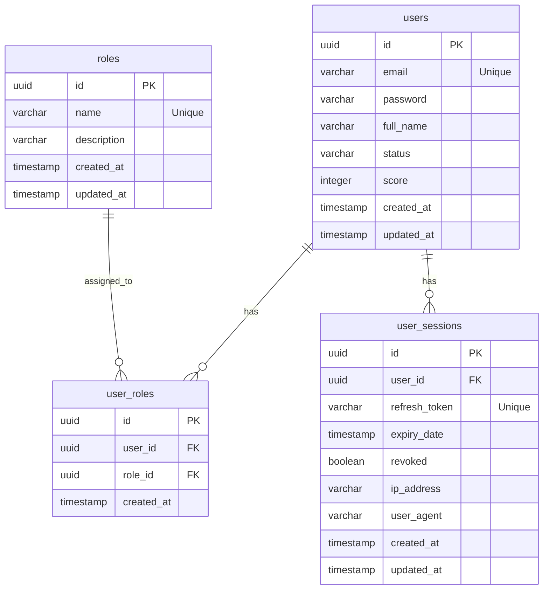
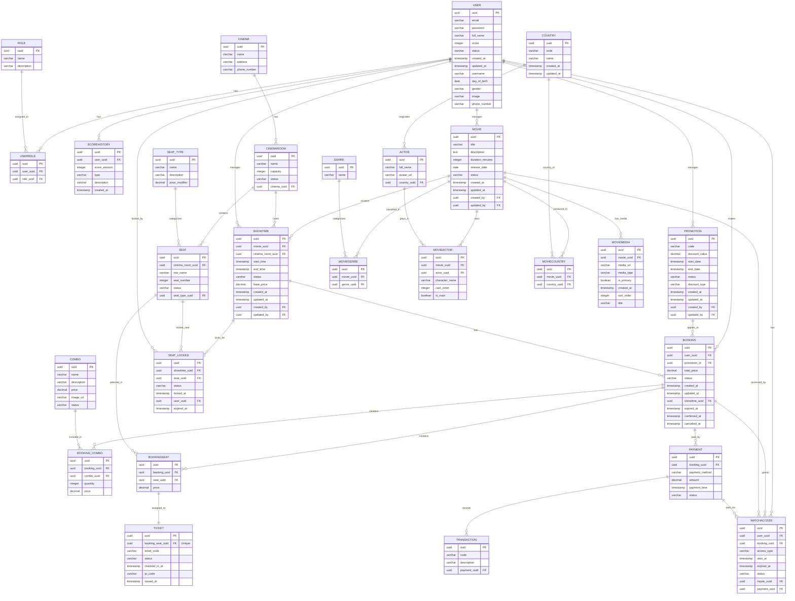

# 🗄️ THIẾT KẾ CƠ SỞ DỮ LIỆU (DATABASE DESIGN) - NASAFILM

Tài liệu này đặc tả chi tiết thiết kế cơ sở dữ liệu quan hệ **PostgreSQL**,bao gồm phân hệ hiện tại (Đã cài đặt trong code Spring Boot JPA) và phân hệ mở rộng toàn diện sau khi áp dụng các chuẩn hóa tối ưu hệ thống, giải quyết triệt để các lỗi thiết kế, trùng lặp và dư thừa dữ liệu.

---

## 📊 1. Sơ đồ các Bảng hiện tại (Phân hệ Xác thực & Phân quyền)

Các thực thể này đã được ánh xạ thành công trong Spring Boot JPA:

---

## 🔮 2. Sơ đồ Thiết kế Cơ sở dữ liệu Mở rộng Toàn diện & Tối ưu (ERD)

Dưới đây là sơ đồ quan hệ thực thể (ERD) hoàn chỉnh mô tả hệ thống cơ sở dữ liệu gồm các phân hệ: Quản lý chi nhánh rạp (`CINEMA`/`CINEMAROOM`), Bắp nước (`COMBO`), Ghế ngồi (`SEAT`/`SEAT_TYPE`), Suất chiếu (`SHOWTIME`), Đặt vé (`BOOKING`/`BOOKINGSEAT`/`TICKET`), Thanh toán (`PAYMENT`), Khuyến mãi (`PROMOTION`), Lịch sử điểm (`SCOREHISTORY`), và Quyền xem phim online (`WATCHACCESS`).

---

## 📝 3. Đặc tả Chi tiết các Bảng Thiết kế Mới (Theo Sơ đồ Chuẩn hóa)

### 3.1. Phân hệ Người dùng & Vai trò (User & Role Module)

#### **Bảng `USER`**
Lưu trữ thông tin chi tiết về tài khoản người dùng và thông tin cá nhân.
* `uuid` (UUID - PK): Khóa chính tự sinh.
* `email` (VARCHAR(255) - Unique, Not Null): Email tài khoản.
* `password` (VARCHAR(255) - Not Null): Mật khẩu đã băm.
* `full_name` (VARCHAR(255)): Tên đầy đủ.
* `score` (INTEGER - Default 0): Điểm tích lũy thành viên.
* `status` (VARCHAR(50)): Trạng thái tài khoản (ACTIVE, INACTIVE, v.v.).
* `created_at` (TIMESTAMP): Thời gian tạo.
* `updated_at` (TIMESTAMP): Thời gian cập nhật.
* `username` (VARCHAR(150)): Tên đăng nhập.
* `day_of_birth` (DATE): Ngày sinh.
* `gender` (VARCHAR(50)): Giới tính.
* `image` (VARCHAR(512)): Đường dẫn ảnh đại diện.
* `phone_number` (VARCHAR(20)): Số điện thoại.

#### **Bảng `ROLE`**
* `uuid` (UUID - PK): Khóa chính.
* `name` (VARCHAR(50) - Unique): Tên vai trò (ADMIN, STAFF, CUSTOMER, v.v.).
* `description` (VARCHAR(255)): Mô tả.

#### **Bảng `USERROLE`**
Bảng trung gian liên kết Nhiều-Nhiều giữa `USER` và `ROLE`.
* `uuid` (UUID - PK): Khóa chính.
* `user_uuid` (UUID - FK): Liên kết với `USER(uuid)`.
* `role_uuid` (UUID - FK): Liên kết với `ROLE(uuid)`.

#### **Bảng `SCOREHISTORY`**
Lịch sử cộng/trừ điểm tích lũy của thành viên.
* `uuid` (UUID - PK): Khóa chính.
* `user_uuid` (UUID - FK): Liên kết với `USER(uuid)`.
* `score_amount` (INTEGER): Số điểm thay đổi (Ví dụ: +10, -50).
* `type` (VARCHAR(50)): Loại biến động (Ví dụ: BOOKING, REWARD, REDEEM).
* `description` (VARCHAR(255)): Mô tả lý do thay đổi.
* `created_at` (TIMESTAMP): Thời gian thực hiện.

---

### 3.2. Phân hệ Rạp chiếu, Ghế ngồi & Dịch vụ đi kèm (Cinema, Seat & Food Module)

#### **Bảng `CINEMA`**
Quản lý thông tin chi nhánh rạp chiếu phim trong hệ thống.
* `uuid` (UUID - PK): Khóa chính tự sinh.
* `name` (VARCHAR(255) - Not Null): Tên chi nhánh rạp (Landmark 81, Nha Trang...).
* `address` (VARCHAR(255) - Not Null): Địa chỉ cụ thể.
* `phone_number` (VARCHAR(20)): Số điện thoại liên hệ của rạp.

#### **Bảng `CINEMAROOM`**
Thông tin về các phòng chiếu phim thuộc chi nhánh rạp.
* `uuid` (UUID - PK): Khóa chính.
* `name` (VARCHAR(100) - Not Null): Tên phòng chiếu.
* `capacity` (INTEGER - Not Null): Sức chứa tối đa.
* `status` (VARCHAR(50)): Trạng thái phòng chiếu (ACTIVE, MAINTENANCE).
* `cinema_uuid` (UUID - FK): Liên kết với `CINEMA(uuid)`.

#### **Bảng `COMBO`**
Quản lý thông tin bắp nước và các gói dịch vụ đi kèm.
* `uuid` (UUID - PK): Khóa chính tự sinh.
* `name` (VARCHAR(255) - Not Null): Tên combo bắp nước.
* `description` (VARCHAR(255)): Mô tả các món có trong combo.
* `price` (DECIMAL(12, 2) - Not Null): Giá bán hiện hành của combo.
* `image_url` (VARCHAR(512)): Đường dẫn hình ảnh minh họa.
* `status` (VARCHAR(50)): Trạng thái combo (ACTIVE, OUT_OF_STOCK, DISABLED).

#### **Bảng `BOOKING_COMBO`**
Bảng trung gian lưu chi tiết bắp nước được chọn mua cùng với vé trong giao dịch.
* `uuid` (UUID - PK): Khóa chính tự sinh.
* `booking_uuid` (UUID - FK): Liên kết với giao dịch đặt vé `BOOKING(uuid)`.
* `combo_uuid` (UUID - FK): Liên kết với dịch vụ `COMBO(uuid)`.
* `quantity` (INTEGER - Not Null): Số lượng combo đặt mua.
* `price` (DECIMAL(12, 2) - Not Null): Giá bán ghi nhận tại thời điểm đặt mua (tránh biến động giá sau này).

#### **Bảng `SEAT_TYPE`**
Phân loại các định dạng ghế ngồi và mức phụ thu tương ứng.
* `uuid` (UUID - PK): Khóa chính.
* `name` (VARCHAR(50) - Not Null): Tên loại ghế (STANDARD, VIP, COUPLE).
* `description` (VARCHAR(255)): Mô tả.
* `price_modifier` (DECIMAL(12, 2) - Default 0.00): Mức phụ thu của loại ghế này (Ví dụ: VIP +20,000đ, COUPLE +40,000đ).

#### **Bảng `SEAT`**
Danh mục ghế cụ thể trong từng phòng chiếu.
* `uuid` (UUID - PK): Khóa chính.
* `cinema_room_uuid` (UUID - FK): Liên kết với phòng chiếu `CINEMAROOM(uuid)`.
* `row_name` (VARCHAR(10) - Not Null): Tên hàng ghế (A, B, C).
* `seat_number` (INTEGER - Not Null): Số thứ tự ghế.
* `status` (VARCHAR(50)): Trạng thái ghế vật lý.
* `seat_type_uuid` (UUID - FK): Liên kết với loại ghế `SEAT_TYPE(uuid)`. (Đã sửa lỗi xung đột khóa ngoại).

#### **Bảng `SEAT_LOCKED`**
Quản lý trạng thái giữ ghế/khóa ghế tạm thời khi khách hàng đang chọn mua vé (tránh trùng ghế).
* `uuid` (UUID - PK): Khóa chính.
* `showtime_uuid` (UUID - FK): Liên kết với suất chiếu `SHOWTIME(uuid)`. (Đã xóa cột trùng lặp).
* `seat_uuid` (UUID - FK): Liên kết với ghế `SEAT(uuid)`.
* `status` (VARCHAR(50)): Trạng thái khóa (LOCKED, EXPIRED).
* `locked_at` (TIMESTAMP): Thời điểm bắt đầu khóa.
* `user_uuid` (UUID - FK): Khách hàng giữ ghế, liên kết với `USER(uuid)`.
* `expired_at` (TIMESTAMP): Thời điểm hết hạn khóa tạm thời.

---

### 3.3. Phân hệ Phim & Suất chiếu (Movie & Showtime Module)

#### **Bảng `MOVIE`**
* `uuid` (UUID - PK): Khóa chính.
* `title` (VARCHAR(255) - Not Null): Tiêu đề phim.
* `description` (TEXT): Tóm tắt nội dung.
* `duration_minutes` (INTEGER - Not Null): Thời lượng phim (phút).
* `release_date` (DATE - Not Null): Ngày khởi chiếu.
* `status` (VARCHAR(50)): Trạng thái phim (NOW_SHOWING, COMING_SOON, ENDED).
* `created_at` (TIMESTAMP): Ngày tạo record.
* `updated_at` (TIMESTAMP): Ngày cập nhật.
* `created_by` (UUID - FK): Admin tạo phim, liên kết `USER(uuid)`.
* `updated_by` (UUID - FK): Admin cập nhật phim gần nhất, liên kết `USER(uuid)`.

#### **Bảng `GENRE`**
* `uuid` (UUID - PK): Khóa chính.
* `name` (VARCHAR(100) - Not Null): Tên thể loại phim (Action, Romance, Comedy, v.v.).

#### **Bảng `MOVIEGENRE`**
Bảng trung gian liên kết Nhiều-Nhiều giữa phim và thể loại.
* `uuid` (UUID - PK): Khóa chính. (Đã sửa từ id thành uuid để đồng bộ quy chuẩn đặt tên).
* `movie_uuid` (UUID - FK): Liên kết với `MOVIE(uuid)`.
* `genre_uuid` (UUID - FK): Liên kết với `GENRE(uuid)`.

#### **Bảng `COUNTRY`**
* `uuid` (UUID - PK): Khóa chính.
* `code` (VARCHAR(10) - Unique): Mã quốc gia (VN, US, KR).
* `name` (VARCHAR(100)): Tên quốc gia.
* `created_at` (TIMESTAMP): Ngày tạo.
* `updated_at` (TIMESTAMP): Ngày cập nhật.

#### **Bảng `MOVIECOUNTRY`**
* `uuid` (UUID - PK): Khóa chính.
* `movie_uuid` (UUID - FK): Liên kết với `MOVIE(uuid)`.
* `country_uuid` (UUID - FK): Liên kết với `COUNTRY(uuid)`.

#### **Bảng `ACTOR`**
* `uuid` (UUID - PK): Khóa chính.
* `full_name` (VARCHAR(255) - Not Null): Họ tên diễn viên.
* `avatar_url` (VARCHAR(512)): Ảnh chân dung diễn viên.
* `country_uuid` (UUID - FK): Quốc tịch diễn viên, liên kết `COUNTRY(uuid)`.

#### **Bảng `MOVIEACTOR`**
Bảng liên kết phân vai diễn viên trong từng bộ phim.
* `uuid` (UUID - PK): Khóa chính.
* `movie_uuid` (UUID - FK): Liên kết `MOVIE(uuid)`.
* `actor_uuid` (UUID - FK): Liên kết `ACTOR(uuid)`.
* `character_name` (VARCHAR(255)): Tên nhân vật đảm nhận.
* `cast_order` (INTEGER): Thứ tự xuất hiện / vai trò diễn xuất.
* `is_main` (BOOLEAN): Xác định phải vai chính hay không.

#### **Bảng `MOVIEMEDIA`**
Lưu trữ các hình ảnh, trailer của phim.
* `uuid` (UUID - PK): Khóa chính.
* `movie_uuid` (UUID - FK): Liên kết `MOVIE(uuid)`.
* `media_url` (VARCHAR(512)): Link ảnh/video.
* `media_type` (VARCHAR(50)): Loại media (POSTER, STILL, TRAILER).
* `is_primary` (BOOLEAN): Poster chính dùng để đại diện hiển thị.
* `created_at` (TIMESTAMP): Thời gian đăng tải.
* `sort_order` (INTEGER): Thứ tự sắp xếp.
* `title` (VARCHAR(255)): Tiêu đề media.

#### **Bảng `SHOWTIME`**
* `uuid` (UUID - PK): Khóa chính.
* `movie_uuid` (UUID - FK): Liên kết `MOVIE(uuid)`.
* `cinema_room_uuid` (UUID - FK): Liên kết `CINEMAROOM(uuid)`.
* `start_time` (TIMESTAMP - Not Null): Thời gian bắt đầu chiếu.
* `end_time` (TIMESTAMP - Not Null): Thời gian kết thúc.
* `status` (VARCHAR(50)): Trạng thái suất chiếu (SCHEDULED, LIVE, CANCELLED).
* `base_price` (DECIMAL(12, 2) - Not Null): Giá vé cơ bản của suất chiếu.
* `created_at` (TIMESTAMP): Ngày tạo.
* `updated_at` (TIMESTAMP): Ngày cập nhật.
* `created_by` (UUID - FK): Nhân viên quản lý lịch chiếu, liên kết `USER(uuid)`.
* `updated_by` (UUID - FK): Nhân viên cập nhật gần nhất, liên kết `USER(uuid)`.

---

### 3.4. Phân hệ Đặt vé & Thanh toán (Booking & Payment Module)

#### **Bảng `PROMOTION`**
Chương trình khuyến mãi áp dụng khi mua vé.
* `uuid` (UUID - PK): Khóa chính.
* `code` (VARCHAR(50) - Unique, Not Null): Mã code coupon.
* `discount_value` (DECIMAL(12, 2) - Not Null): Mức giảm giá.
* `start_date` (TIMESTAMP - Not Null): Ngày bắt đầu áp dụng.
* `end_date` (TIMESTAMP - Not Null): Ngày kết thúc.
* `status` (VARCHAR(50)): Trạng thái mã (ACTIVE, EXPIRED).
* `discount_type` (VARCHAR(50)): Hình thức giảm giá (PERCENTAGE, FIXED_AMOUNT).
* `created_at` (TIMESTAMP): Ngày tạo.
* `updated_at` (TIMESTAMP): Ngày cập nhật.
* `created_by` (UUID - FK): Người tạo khuyến mãi, liên kết `USER(uuid)`.
* `updated_by` (UUID - FK): Người cập nhật khuyến mãi gần nhất, liên kết `USER(uuid)`.

#### **Bảng `BOOKING`**
* `uuid` (UUID - PK): Khóa chính.
* `user_uuid` (UUID - FK): Khách hàng đặt vé, liên kết `USER(uuid)`.
* `promotion_id` (UUID - FK, Nullable): Mã ưu đãi áp dụng, liên kết `PROMOTION(uuid)`.
* `total_price` (DECIMAL(12, 2) - Not Null): Tổng tiền thanh toán cuối cùng.
* `status` (VARCHAR(50)): Trạng thái giao dịch (PENDING, CONFIRMED, CANCELLED).
* `created_at` (TIMESTAMP): Ngày tạo.
* `updated_at` (TIMESTAMP): Ngày cập nhật.
* `showtime_uuid` (UUID - FK): Suất chiếu được đặt, liên kết `SHOWTIME(uuid)`.
* `expired_at` (TIMESTAMP): Thời gian hết hạn giữ chỗ để thanh toán.
* `confirmed_at` (TIMESTAMP): Thời điểm xác nhận thanh toán thành công.
* `cancelled_at` (TIMESTAMP): Thời điểm hủy giao dịch.

#### **Bảng `BOOKINGSEAT`**
Chi tiết các ghế ngồi được chọn trong hóa đơn đặt vé.
* `uuid` (UUID - PK): Khóa chính.
* `booking_uuid` (UUID - FK): Liên kết `BOOKING(uuid)`.
* `seat_uuid` (UUID - FK): Liên kết `SEAT(uuid)`.
* `price` (DECIMAL(12, 2) - Not Null): Giá vé tương ứng cho ghế đó, được tính bằng `SHOWTIME.base_price + SEAT_TYPE.price_modifier`. (Đã loại bỏ showtime_uuid dư thừa).

#### **Bảng `TICKET`**
Vé xem phim thực tế gửi cho khách hàng. Vé xem phim có quan hệ 1-1 trực tiếp với ghế đã đặt (`BOOKINGSEAT`).
* `uuid` (UUID - PK): Khóa chính.
* `booking_seat_uuid` (UUID - FK - Unique): Khóa ngoại 1-1 liên kết trực tiếp tới ghế đặt (`BOOKINGSEAT.uuid`). (Từ `BOOKINGSEAT` có thể suy ra `BOOKING`, do đó đã loại bỏ cột `booking_uuid` dư thừa).
* `ticket_code` (VARCHAR(100) - Not Null): Mã số vé.
* `status` (VARCHAR(50)): Trạng thái vé (ACTIVE, USED, REFUNDED).
* `checked_in_at` (TIMESTAMP): Thời điểm soát vé vào cửa.
* `qr_code` (VARCHAR(512)): Dữ liệu mã vạch/QR để kiểm tra.
* `issued_at` (TIMESTAMP): Thời gian xuất vé.

#### **Bảng `PAYMENT`**
* `uuid` (UUID - PK): Khóa chính.
* `booking_uuid` (UUID - FK): Liên kết `BOOKING(uuid)`.
* `payment_method` (VARCHAR(50)): Phương thức thanh toán (MOMO, VNPAY, CASH, CARD).
* `amount` (DECIMAL(12, 2) - Not Null): Số tiền giao dịch thực tế.
* `payment_time` (TIMESTAMP): Thời gian xử lý thanh toán.
* `status` (VARCHAR(50)): Trạng thái thanh toán (COMPLETED, FAILED, PENDING).

#### **Bảng `TRANSACTION`**
Lưu thông tin giao dịch ngân hàng / cổng thanh toán chi tiết.
* `uuid` (UUID - PK): Khóa chính.
* `code` (VARCHAR(100) - Unique, Not Null): Mã giao dịch của đối tác thanh toán.
* `description` (VARCHAR(255)): Nội dung giao dịch.
* `payment_uuid` (UUID - FK): Liên kết `PAYMENT(uuid)`.

---

### 3.5. Phân hệ Quyền xem phim (Watch Access Module)

#### **Bảng `WATCHACCESS`**
Quản lý quyền xem phim trực tuyến/online của người dùng (khi mua gói xem phim hoặc xem phim qua nền tảng trực tuyến của hệ thống rạp).
* `uuid` (UUID - PK): Khóa chính.
* `user_uuid` (UUID - FK): Tài khoản sở hữu quyền xem, liên kết `USER(uuid)`.
* `booking_uuid` (UUID - FK, Nullable): Hóa đơn đặt vé tương ứng (nếu mua qua booking), liên kết `BOOKING(uuid)`.
* `access_type` (VARCHAR(50)): Loại hình truy cập (Ví dụ: SINGLE_MOVIE_RENTAL, SYSTEM_SUBSCRIPTION).
* `start_at` (TIMESTAMP): Thời điểm kích hoạt quyền xem.
* `expired_at` (TIMESTAMP): Thời điểm hết hạn truy cập.
* `status` (VARCHAR(50)): Trạng thái truy cập (ACTIVE, EXPIRED).
* `movie_uuid` (UUID - FK): Phim được cấp quyền xem, liên kết `MOVIE(uuid)`.
* `payment_uuid` (UUID - FK): Giao dịch thanh toán liên kết, liên kết `PAYMENT(uuid)`.

---
